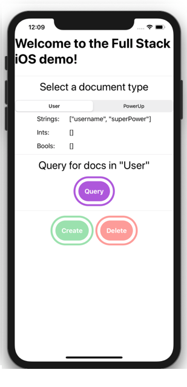

# FullStackIOS

This is an experimental idea where the "full stack" of an iOS app is developed by inheriting from one class called `FullStackObject`. Subclasses of this class are basically data models with super-full-stack-powers. All subclasses of `FullStackObject` should be put inside the `SharedApp` project in your Xcode workspace. Then your `iOS App` project (frontend) and `ServerApp` project (backend) will read your data models in `SharedApp` to automatically handle all things full stack.

I have no idea if this project will work, but I have a hunch, so I'm just coding it to explore. My hopes is that it will remove a lot a wasted development time when making full stack apps. 

My basic contention is that most wasted time in full stack development comes from what I call "changing environment contexts." For example, switching from Xcode to build my iOS frontend to VSCode to build my Firebase backend (server). Here are a list of time-wasters that come with changing environment contexts.
 
 - Using strings as keys which need to be identical on the frontend and server. If a string is mistyped, the IDE does not through an error. Time can be wasted while the developer scratches their head until they realized they made a spelling mistake. I hope this project will all you to use typed objects between your frontend and server function calls and databases calls so that you get compile-time errors. I hope that REST APIs (which will require strings...like the use of json) will be automatically generated on deployment.
  
  - Rewriting the same data model in multiple contexts. i.e. writing your data model for an object called "Dog" in you iOS project in Xcode, your Firebase project in VSCode, and in your Firestore database on Firebase's website. I hope this project would allow you to have to only write your data model in one place as a Swift class which automatically deploys to all your projects and databases.
  
  - One developer screwing up another's test because they deployed the server in the dev enviroment which broke that other developer's test. I don't know if my personal experience of this happening is just because my team was bad...haha! But regardless, I hope this project would enable each developer to simluate the entire full stack on their local machine, so there won't be any shared dependencies between developers.
  
  
Problems my project will not address

- Needing a shared backend (server) with multiple front ends. I don't think it's possible to fix this, but maybe something will come in the future. For now, I'm specifically targeting one frontend (native iOS) and one backend (Vapor) to explore the usefulness of this idea. If it is successful in increasing productivity enough to merit more research, then I might try to find a way to solve this problem. At the moment, I'm at a loss. This might be the reason why system is ultimately a bad one.

- Allowing backend code (on the server) to be in a different langauge than the frontend. This is just too hard and I don't want to make bindings from Swift to whatever it is someone wants. It's not worth it. I also want the Xcode debugger to step through nicely, and keeping everything in Swift is probably the best way to do that.

This basic idea is to have three projects in one Xcode workspace

 - `ServerApp`
 - `SharedApp`
 - `iOSApp`

Both the `ServerApp` and `iOSApp` import the `SharedApp` as a framework.

All development for elements touching the FullStack (i.e. user profile data) should be constructed in `SharedApp`.

During a development build (for testing only), the `SharedApp` is built and used by the `iOSApp` to simulate a working server. No actual server is in use, so debugging will be easy. You can literally "step through" line-by-line with the Xcode debugger to try out your Full Stack app!

During a production build, the `SharedApp` is built and used by the `iOSApp`, but the `iOSApp` will make network calls by automatically generated endpoints which will hit the `ServerApp`. The `ServerApp` will have used the built `SharedApp` and will run the exact same Swift code you had used to simulate the server to in a development build.

The `SharedApp` interacts with a database through a `MongoDbDelegate` protocol. This protocol is implemented 1 of 2 classes.

1. `SimulatedServerDb` - Will simulate a `MongoDb` using `Couchbase Lite` on the `iOSApp`. I wish there was a better way, but I don't have time to figure out how to get `Mongodb` running on iOS. It's probably impossible or not worth the effort. The reason I want a simulation of the server's db on iOS is so that we could run the full stack app on iOS alone for rapid testing and development. The core idea of this project is to remove all the wasted time changning contexts when developing--so if you can run your entire project on an iOS app (including server logic and databases) and taking that simulation and deploying it to a real server is 100% automated, I anticipate there will be massive cut in development time. At least, that is my hope for this project.

2. `ServerDb` - This is run on the `ServerApp` running `Vapor` and will interact with a `MongoDb` instance using `MongoKitten`.

